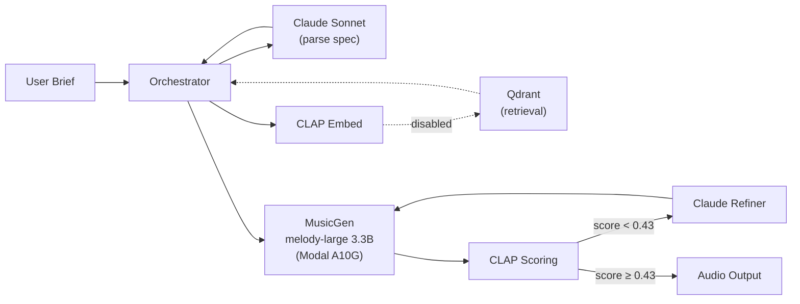
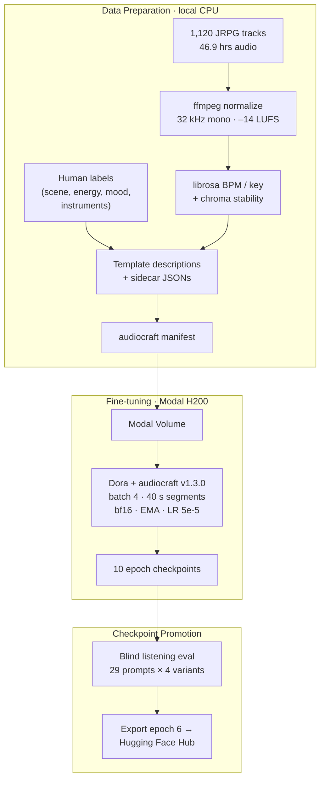
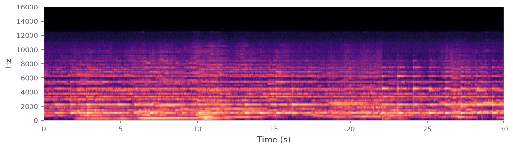
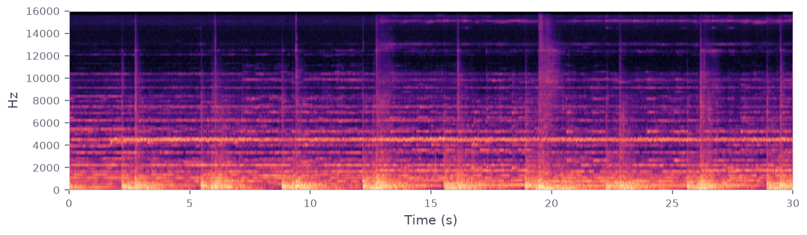
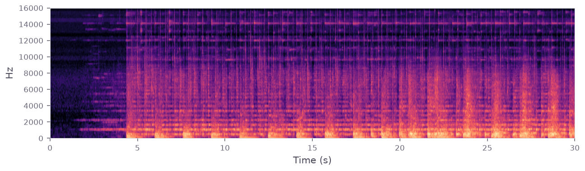
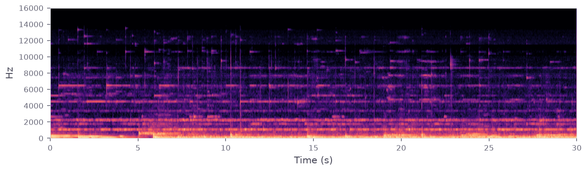
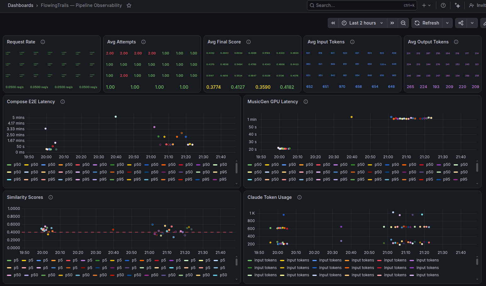

  

  

  <strong>AI-powered video game music generation, fine-tuned on a curated JRPG collection.</strong> 
  Describe a scene — get back a .wav that sounds like it belongs in the game.

---

## Architecture

### Inference Pipeline

The orchestrator runs a score-and-refine loop: Claude parses a natural-language brief into a structured `MusicSpec`, MusicGen generates audio, and CLAP measures semantic alignment between the output and the original intent. If the score falls below threshold, Claude revises the spec and MusicGen retries — up to 2 attempts, returning the best result.

| Component     | Platform                                      | Rationale                                                                                           |
| ------------- | --------------------------------------------- | --------------------------------------------------------------------------------------------------- |
| GPU inference | Modal A10G (24 GB VRAM)                       | ~14 GB used — cheapest GPU that fits the 3.3B model + MBD decoder                                   |
| Audio model   | MusicGen melody-large 3.3B, custom fine-tuned | Full fine-tune on 1,120 JRPG tracks for intentional stylistic bias                                  |
| Decoder       | Multi-Band Diffusion (MBD)                    | Higher perceptual quality than EnCodec; ~2× latency tradeoff accepted                               |
| Text LLM      | Claude Sonnet 4.6                             | Structured JSON spec parsing + spec refinement on retry                                             |
| Embeddings    | CLAP `htsat-unfused` (512-dim)                | CPU in-process — avoids network hop on every scoring call in the retry loop                         |
| Vector DB     | Qdrant Cloud                                  | Retrieval index built but disabled — A/B test showed melody conditioning hurts the fine-tuned model |
| Observability | Grafana Cloud (OTLP direct)                   | Distributed tracing + metrics with no collector overhead                                            |

### Training Pipeline

**Corpus.** 1,120 tracks across 7 scene types (cutscene 42 %, town 16 %, dungeon 14 %, boss 12 %, battle 9 %, exploration 6 %, menu 2 %). 15 mood tags, average 2.2 per track. Energy split: mid 51 %, high 36 %, low 13 %. Class imbalance is intentional — the corpus distribution is the style being modeled.

**Calibration.** 25 evaluation prompts against the fine-tuned model: mean CLAP similarity 0.46, range 0.32–0.56. Accept threshold set to p25 (0.43), targeting ~25 % retry rate.

| Component            | Platform                          | Rationale                                                                                                                           |
| -------------------- | --------------------------------- | ----------------------------------------------------------------------------------------------------------------------------------- |
| Training compute     | Modal H200 (141 GB VRAM)          | batch 4 × 40 s segments in bf16 with EMA — ~2× more cost-efficient than A100 per second of audio trained                            |
| Training framework   | audiocraft v1.3.0 · Dora          | Pinned SHA for reproducibility; Dora handles checkpoint resume across preemptions                                                   |
| Runtime              | torch 2.1.0+cu121, CUDA 12.1      | Separate from inference stack (torch 2.6) — audiocraft v1.3.0 requires torch 2.1                                                    |
| Caption augmentation | Template descriptions             | audiocraft's condition-merging augmentation provides per-epoch caption variance from a single description per track — no LLM needed |
| Model registry       | Hugging Face Hub                  | Tag-driven promotion; swap model = redeploy only                                                                                    |
| Training run         | 10 epochs × 528 updates, ~2.6 hrs | Epoch 6 selected via blind listening; best quality-to-overfitting tradeoff                                                          |

---

## Generated Samples

All samples generated from the custom fine-tuned model. 30 seconds, text-only generation (no melody conditioning), MBD decoding.

 

**Farewell at Dawn** — *A bittersweet cutscene theme for a character saying goodbye at sunrise. Gentle piano over sustained strings, building toward a quietly hopeful resolution.*

CLAP 0.58 · 1 attempt · [`farewell-at-dawn.wav`](samples/farewell-at-dawn.wav)

 

**Shadow Throne** — *The dark lord's throne room. Ominous pipe organ chords with deep choir chanting, slow heavy percussion like a heartbeat. Oppressive, grandiose, suffocating dread.*

CLAP 0.47 · 1 attempt · [`shadow-throne.wav`](samples/shadow-throne.wav)

 

**Midnight Duel** — *A tense one-on-one sword fight under moonlight. Fast staccato strings trading phrases with sharp brass accents, tight snare patterns, and an undercurrent of urgency.*

CLAP 0.43 · 1 attempt · [`midnight-duel.wav`](samples/midnight-duel.wav)

 

**Frozen Labyrinth** — *An ice dungeon with crystalline walls that ring when struck. Cold, glassy synth textures over slow deliberate percussion, with high-pitched bell tones that feel brittle and dangerous.*

CLAP 0.42 · 2 attempts · [`frozen-labyrinth.wav`](samples/frozen-labyrinth.wav)

---

## Design Decisions

**Full fine-tune, not LoRA.** No published MusicGen LoRA vs full-FT quality comparison exists. The HF-to-audiocraft weight merge path is unsolved upstream, making LoRA export impractical.

**Melody conditioning disabled after A/B test.** Tested text-only vs retrieval-conditioned vs random-conditioned generation across 20 prompts. Text-only won (mean CLAP 0.456 vs retrieval 0.411 vs random 0.415). Chroma conditioning forces reference melodies onto output, constraining the fine-tuned model rather than helping it. Retrieval infrastructure retained for future use.

**Human eval is primary, CLAP score is secondary.** Checkpoint selection by blind listening across 29 prompts × 4 variants per checkpoint. CLAP serves as a regression detector and tiebreaker, not the quality signal.

**Stylistic bias is intentional.** The model is deliberately skewed toward dramatic, orchestral JRPG material — the corpus distribution defines the target style. No class balancing applied.

---

## Observability

Full distributed tracing via OpenTelemetry (OTLP → Grafana Tempo). Every request produces a trace spanning the full pipeline: `compose` → `parse_query` (Claude) → `retrieve` (Qdrant) → `generate` (MusicGen GPU) → `score` (CLAP) → optional `refine` (Claude). GenAI semantic conventions on all LLM spans. Trace context propagated across Modal function boundaries via explicit `traceparent` injection.

Grafana dashboard ([`deploy/grafana/dashboard.json`](deploy/grafana/dashboard.json)) tracks request rate, latency percentiles, similarity score distribution, Claude token usage, and retry rates.

---

## MCP Tools

Two Model Context Protocol servers expose pipeline components for external agent use:

- **`mcp_servers/retrieval_server.py`** — `search_corpus`: text → top-K similar reference tracks
- **`mcp_servers/musicgen_server.py`** — `generate_music`: spec → base64 audio
