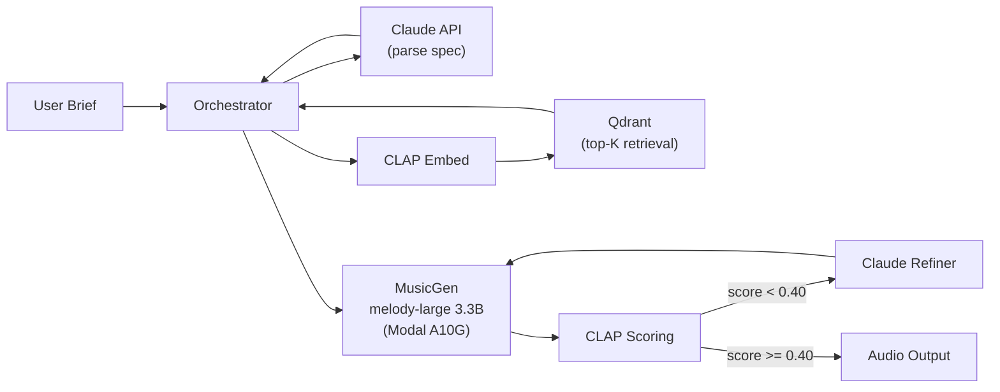

# FlowingTrails

[](https://github.com/Kairn/flowing-trails/actions/workflows/eval.yml)

AI-powered video game music generation. Describe what you want — get back a .wav that sounds like it belongs in the game.

```
Input:  "intense boss fight theme, dark and orchestral, fast tempo"
Output: boss-battle.wav (10s, CLAP similarity 0.50)
```

## Architecture



The orchestrator runs a score-and-refine loop: if the generated audio's CLAP similarity to the original intent falls below the threshold, Claude rewrites the spec and MusicGen tries again (up to 2 attempts).

## Samples

| Brief | File | Score |
|-------|------|-------|
| Peaceful exploration through an enchanted forest | [`calm-exploration.wav`](samples/calm-exploration.wav) | 0.47 |
| Intense boss battle with heavy percussion and orchestral hits | [`boss-battle.wav`](samples/boss-battle.wav) | 0.50 |
| Nostalgic 8-bit chiptune town theme, upbeat and catchy | [`retro-town.wav`](samples/retro-town.wav) | 0.43 |

## Stack

| Concern | Platform |
|---------|----------|
| GPU inference | Modal (A10G, 24GB VRAM) |
| Text LLM | Anthropic Claude API (Sonnet) |
| Audio generation | `facebook/musicgen-melody-large` (3.3B) + Multi-Band Diffusion |
| Audio/text embeddings | `laion/clap-htsat-unfused` (512-dim) |
| Vector database | Qdrant Cloud |
| Observability | Grafana Cloud (OTel traces + metrics) |
| CI | GitHub Actions |

## How to Run

**Prerequisites:** Python 3.11+, Modal account, API keys for Anthropic / Qdrant / Grafana OTLP.

```bash
cp .env.example .env   # fill in keys
python -m venv .venv && source .venv/bin/activate
pip install -r requirements.txt

# Deploy services
make deploy-all        # musicgen_service + orchestrator on Modal

# Index the reference corpus
make index             # CLAP embed → Qdrant upsert

# Generate samples
COMPOSE_URL=https://<your-endpoint> make samples
```

## Eval

**CI eval** (`make eval`): 10 golden tracks scored against their CLAP text embeddings — verifies the scoring pipeline catches regressions. Runs on every push.

**Full eval** (`make eval-full`): 25 diverse prompts across 11 VGM categories, end-to-end against the live endpoint.

| Metric | Value |
|--------|-------|
| Prompts | 25 |
| Pass rate | 19/23 (2 infra errors excluded) |
| Mean CLAP score | 0.46 |
| Median latency | 30s |
| Threshold | 0.40 |
| Max attempts | 2 |

## Observability

Full distributed tracing via OpenTelemetry (OTLP → Grafana Tempo). Every request produces a trace spanning:

- `compose` (orchestrator) → `parse_query` (Claude) → `retrieve` (Qdrant) → `generate` (MusicGen GPU) → `score` (CLAP) → optional `refine` (Claude)

GenAI semantic conventions on all LLM spans. Grafana dashboard in [`deploy/grafana/dashboard.json`](deploy/grafana/dashboard.json) tracks: request rate, latency percentiles, similarity score distribution, Claude token usage, retry rates.

## MCP Tools

Two Model Context Protocol servers expose pipeline components for external agent use:

- **`mcp_servers/retrieval_server.py`** — `search_corpus`: text → top-K similar reference tracks
- **`mcp_servers/musicgen_server.py`** — `generate_music`: spec → base64 audio
